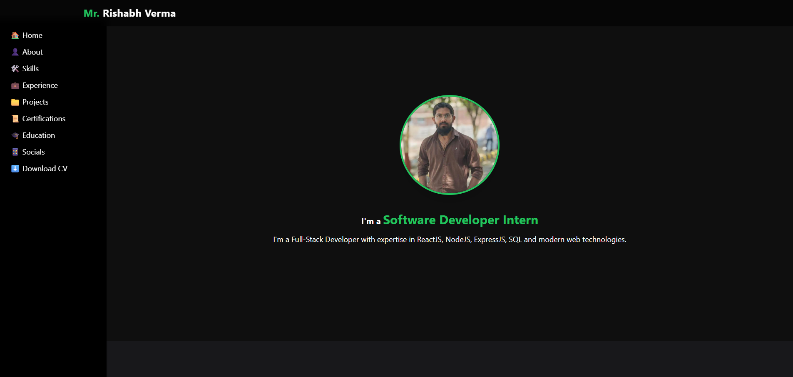

# 🌐 Rishabh Verma — Personal Portfolio Website

Welcome to my **developer portfolio website**! This fully responsive site showcases my work, experience, education, and technical skills as a **Full-Stack Developer** (MERN). Built with **HTML**, **Tailwind CSS**, and enhanced using **GSAP** for animations, the site supports **dark/light mode**, smooth scrolling, and mobile responsiveness.

## 📸 Preview

- [Live Demo]('https://rishabh-060.netlify.app/')

- 

---

## 🚀 Features

- 🎨 Clean, modern UI built with **Tailwind CSS**
- 🌗 Dark / Light mode with animated toggle
- 📱 Mobile-friendly sidebar navigation
- 🧲 Smooth scrolling with **GSAP + ScrollTrigger**
- 📌 Scrollspy highlighting for sections
- 🗂 Dynamic Projects & Skills cards with animations
- ⬇️ Downloadable Resume (PDF)
- ☝️ Floating scroll-to-top button (optional)
- 🎓 Sections for Education, Certifications, Experience, and Social Links

---

## 🧰 Tech Stack

| Frontend                         | Scroll                       | Icons                        |
|----------------------------------|------------------------------|------------------------------|
| HTML5                            | ScrollTrigger                | Remix Icons                  |
| Tailwind CSS                     | Locomotive (optional)        | Responsive Design            |

---

## 🧑‍💻 Sections Overview

- **Hero Section** – Personal branding & introduction
- **About Me** – Brief academic and career summary
- **Skills** – Categorized list of tech stacks
- **Experience** – Professional work experience
- **Projects** – Showcased major web apps (ScanMyMeal, Blo-Docs, etc.)
- **Certifications** – Relevant tech certifications
- **Education** – Academic qualifications
- **Social Profiles** – Linked social handles

---

## 📥 Resume

- 📄 [Download Resume](./media/RISHABH-VERMA.pdf)

---

## 🔧 Installation & Usage

- Clone the repo:

```bash
git clone https://github.com/rishabh-060/my-portfolio.git
cd my-portfolio
```

## 🙏 Thanks For visit @rishabh-060 🙌🫡.